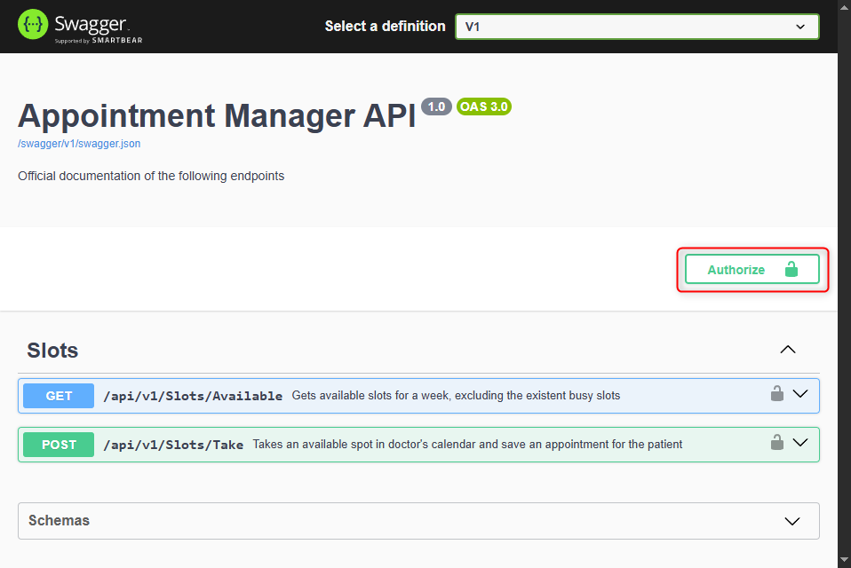

# Appointment Manager
Doctors offer slots to patients. A slot is a period of time which the patient could ask
for a visit. The doctor defines a slot duration (for example, 20 minutes) and
determines the work period (from 8 am to 1 pm, for example). The doctor expects
that the patient will be able to see available slots and book an appointment.
The user should be able to see slots by week, select one and fill in the required data
to book it.

## How to use Appointment Manager

1. Open the solution in Visual Studio using the file `AppointmentManager.sln`.

2. Build the solution.

3. Set as startup project `AppointmentManager.Presentation` and run the application using the profile `Development`. Swagger must be visible on `http://localhost:5292/swagger/index.html`.

    :information_source:  Application can be started using `Start Without Debugging`

4. To use correctly the application, click on `Authorize` and introduce the required user name and password

    

5. Execute the `GET` endpoint to receive a collection of available slots with your doctor.

6. Once the desired slot is detected, please use the `POST` endpoint to take that slot.

## Observations

* For simplicity, **all sensitive data is available in the file `launchSettings.json`**. Ideally, this information should not be in the repository and be provided from services like AWS Secrets Manager.
* Every endpoint contains documentation and examples for better understanding.
* This project has been done using clean architecture as better as possible.
Any feedback about it is more than welcome.
* **Branching strategy in this project has not been used due to the lack of a team. Within a team, it would have been wiser that each feature of the application would have been created in its branch and merged to master after:**
    * Create a Pull Request with further information about the changes
    * Code Review done by the team
* Requirements provided in the document were not accurate, finding the following issues:
    - The endpoint `https://draliatest.azurewebsites.net/api/availability/GetWeeklyAvailability/` from Slot service does not provide the same information written in the document, having a new property named `Facility Id`, which is mandatory to take slots.

        

    - The body used in the endpoint `https://draliatest.azurewebsites.net/api/availability/TakeSlot` requires the Facility Id, otherwise a bad request is received.

        

## Project configuration

| Scope  | Resources(s)  |
|---|---|
| Backend | .NET 8 LTS  |
| Frontend  | Swagger |
| Testing  | xUnit |
| Mock frameworks  | Moq |
| Others | Serilog
| | Fluent Validations
| Software architecture patterns | RESTful API design
| Design patterns | CQRS
| | Builder
| | SOLID principles
| Development tools | Visual Studio Professional 2022, Version 17.13.6
| | Visual Studio Code 1.100.1
| | ReSharper 2025.1.2 Trial Version

## Next steps

* Configure OpenTelemetry to send metrics to DataDog
* Increase test coverage, specially on end to end tests
* Upgrade to .NET 9
* Add CI/CD pipelines
